# 🎬 MoviesHub

MoviesHub is a full-stack movie booking web application inspired by movie ticket booking platforms such as BookMyShow.

The application allows users to register and log in, browse movies, view movie details, select theatres and shows, choose seats and snacks, complete checkout, confirm bookings, and view their booking history.

The backend is developed using **Java Spring Boot**, while the frontend is developed using **JSP, HTML, CSS, and JavaScript**.

---

## 📌 Project Overview

MoviesHub provides a complete movie booking workflow:

```text
User
 │
 ▼
Login / Register
 │
 ▼
Browse Movies
 │
 ▼
Movie Details
 │
 ▼
Select Theatre & Show
 │
 ▼
Select Seats
 │
 ▼
Select Snacks
 │
 ▼
Checkout
 │
 ▼
Confirm Booking
 │
 ▼
Booking Confirmation
 │
 ▼
Booking History
```
## ✨ Features

### 👤 User Management

- User registration
- User login
- Session-based login
- User profile
- Update profile information
- Logout
- Role display

### 🎬 Movie Management

- Display all movies
- Search movies
- Filter movies
- View movie details
- Display movie rating
- Display movie genre
- Display movie language
- Display movie duration
- Display movie release date
- Display movie description
- Movie promotional image slider

### 🎭 Theatre & Shows

- View theatres
- View screens
- View available shows
- Display show date
- Display show time
- Display ticket price

### 💺 Seat Selection

- Display seats for selected screen
- Select multiple seats
- Calculate seat price automatically
- Prevent checkout without selecting a seat

### 🍿 Snacks

- Display available snacks
- Select snacks
- Increase snack quantity
- Decrease snack quantity
- Display first three snacks
- View additional snacks
- Calculate snack total

### 💳 Checkout

- Display selected movie
- Display theatre and screen
- Display show date and time
- Display selected seats
- Display selected snacks
- Display seat total
- Display snack total
- Display grand total
- Confirm booking

### 📋 Booking History

- Display user's bookings
- Display movie information
- Display theatre information
- Display booking ID
- Display booking status
- View selected seats
- View selected snacks

### 👤 Profile

- Display user information
- Update name
- Update email
- Update phone number
- Display user role
- Role is not editable from the profile

---

## 🛠️ Technologies Used

### Backend

- Java
- Spring Boot
- Spring MVC
- Spring Data JPA
- Hibernate ORM
- REST APIs
- MySQL

### Frontend

- JSP
- HTML5
- CSS3
- JavaScript
- JavaScript Fetch API

### Tools

- Eclipse / VS Code
- MySQL
- Maven
- Git
- GitHub
- Apache Tomcat

---

## 📌 Project Overview

MoviesHub is a full-stack movie booking application where users can:

- Register an account
- Login securely
- Browse available movies
- Search and filter movies
- View complete movie details
- View available theatres and shows
- Select seats
- Select snacks
- Review the booking in checkout
- Confirm the booking
- View booking confirmation
- View booking history
- Manage their profile
- Logout from the application

The application uses **Spring Boot REST APIs** for backend communication and **JavaScript Fetch API** for sending and receiving data from the frontend.

---

## 📁 Project Structure

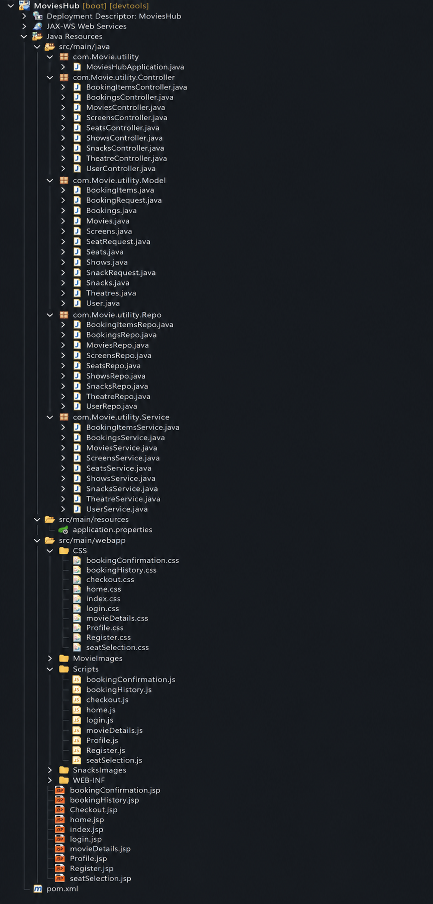

The project is organized into separate layers for backend, frontend, images, and configuration.

### Backend

- `Controller` – Handles REST API requests
- `Service` – Contains business logic
- `Repo` – Handles database operations using Spring Data JPA
- `Model` – Contains entity classes
- `MoviesHubApplication.java` – Main Spring Boot application

### Frontend

- JSP pages – Application user interface
- CSS files – Page styling
- JavaScript files – Frontend logic and REST API communication

### Resources

- `application.properties` – Database and Spring Boot configuration

### Other

- `MovieImages` – Movie images used in the application
- `Screenshots` – Project screenshots used in this README
- `pom.xml` – Maven project configuration

## 🏗️ Application Architecture

The application follows a layered architecture:
```
JSP + JavaScript
        ↓
   REST Controller
        ↓
      Service
        ↓
    Repository
        ↓
      MySQL
```
## 🔌 REST API Endpoints

### 👤 User APIs

- `POST /addUser`
- `POST /login`
- `PUT /updateUser/{id}`
- `GET /getUserById/{id}`
- `GET /getAllUsers`

### 🎬 Movie APIs

- `GET /getAllMovies`
- `GET /getMovieById/{id}`
- `GET /getMoviesByLanguage/{language}`
- `PUT /updateMovie/{id}`
- `DELETE /deleteMovie/{id}`

### 🎭 Theatre APIs

- `GET /getAllTheatres`
- `GET /getTheatreById/{id}`
- `GET /getScreensByTheatreId/{theatreId}`

### 🎥 Show APIs

- `GET /getAllShows`
- `GET /getShowById/{id}`
- `GET /getShowsByMovieId/{movieId}`
- `GET /getShowsByScreenId/{screenId}`

### 🖥️ Screen APIs

- `GET /getAllScreens`
- `GET /getScreenById/{id}`
- `GET /getScreensByTheatreId/{theatreId}`

### 💺 Seat APIs

- `GET /getAllSeats`
- `GET /getSeatById/{id}`
- `GET /getSeatsByScreenId/{screenId}`

### 🍿 Snack APIs

- `GET /getAllSnacks`
- `GET /getSnackById/{id}`

### 🎟️ Booking APIs

- `POST /confirmBooking`
- `GET /getAllBookings`
- `GET /getBookingById/{id}`
- `GET /getBookingsByUserId/{userId}`
- `PUT /updateBooking/{id}`
- `DELETE /deleteBooking/{id}`

### 📦 Booking Item APIs

- `GET /getAllBookingItems`
- `GET /getBookingItemById/{id}`
- `GET /getBookingItemsByBookingId/{bookingId}`
- `PUT /updateBookingItem/{id}`
- `DELETE /deleteBookingItem/{id}`

## 🗄️ Database Design

MoviesHub uses **MySQL** as the database.

### Main Tables

- `user` – Stores user account information
- `movies` – Stores movie information
- `theatres` – Stores theatre information
- `screens` – Stores screen information
- `seats` – Stores seat information
- `shows` – Stores movie show information
- `snacks` – Stores available snack information
- `bookings` – Stores booking information
- `booking_items` – Stores seats and snacks associated with a booking

### Entity Relationships

```text
User
 │
 └── Bookings
       │
       ├── Shows
       │     │
       │     ├── Movies
       │     │
       │     └── Screens
       │           │
       │           ├── Theatres
       │           │
       │           └── Seats
       │
       └── BookingItems
              │
              ├── Seats
              │
              └── Snacks
```

## 🔐 Session Management

MoviesHub uses `HttpSession` to maintain the logged-in user's session.

### Login

After successful login, the user object is stored in the session:

```java
session.setAttribute("user", user.get());
```
Navigation Based on Login

Logged Out:

Home

-Login
-Register

Logged In:

-Home
-Booking History
-Profile
-Logout

Logout
-The session is invalidated.
-The user is redirected to index.jsp.
-Login and Register options are displayed again.

## 🎟️ Booking Process

The booking process in MoviesHub follows these steps:

1. User selects a movie.
2. User views the available theatres and shows.
3. User selects a show.
4. Available seats are loaded for the selected screen.
5. User selects one or more seats.
6. User selects snacks if required.
7. The seat and snack totals are calculated.
8. User proceeds to the checkout page.
9. Selected booking details are displayed for review.
10. User confirms the booking.
11. The booking is saved in the database.
12. Booking confirmation is displayed.
13. The booking can be viewed in Booking History.

## 🧮 Price Calculation

The application calculates the booking amount dynamically.

### Seat Total

- Seat Total = Number of Selected Seats × Show Price

### Snack Total

- Snack Total = Snack Price × Quantity

### Grand Total

- Grand Total = Seat Total + Snack Total
## 📸 Application Screenshots

### 🏠 Home Page

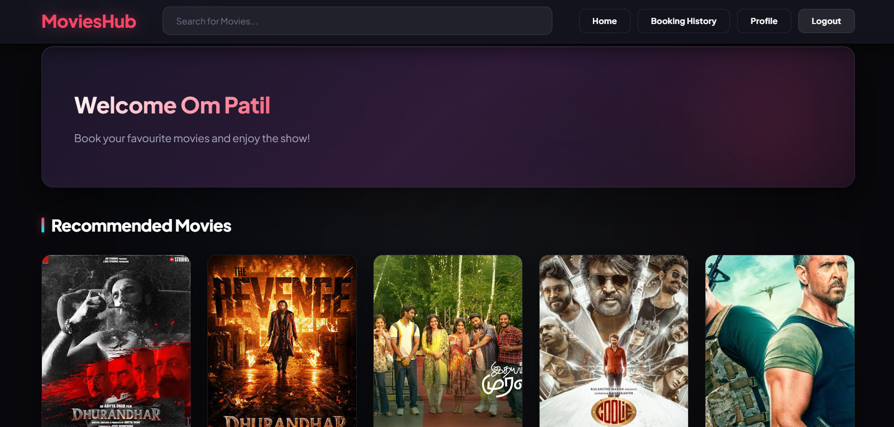

The Home Page displays the available movies and provides options to search and browse movies. Logged-in users can also access their booking history and profile.

### 🎬 Movie Details

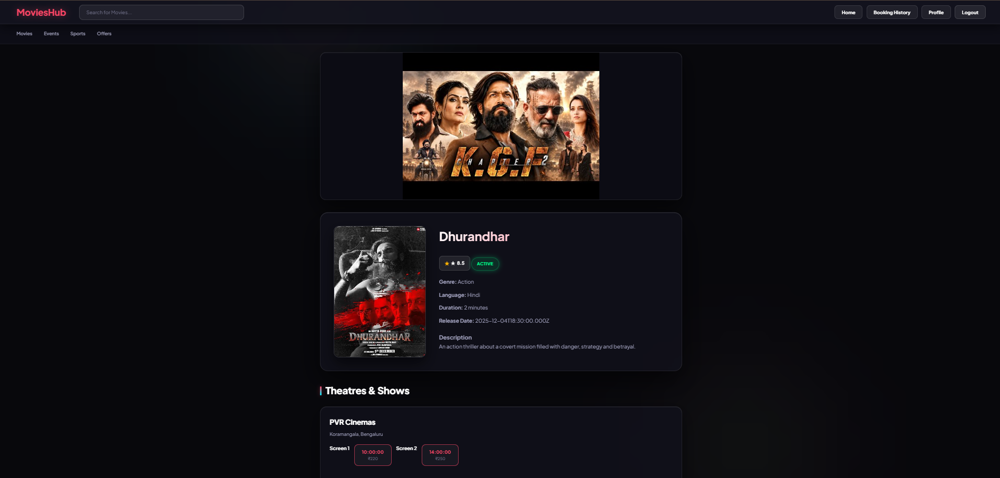

The Movie Details page displays information about the selected movie along with available theatres, screens, and shows.

### 💺 Seat Selection

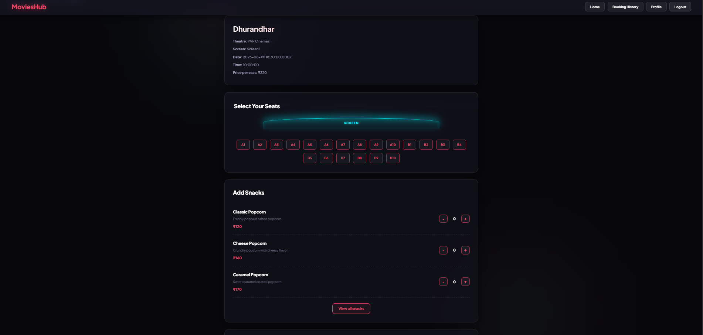

The Seat Selection page allows users to select their preferred seats for the selected show. Users can also select snacks and view the total amount.

### 💳 Checkout

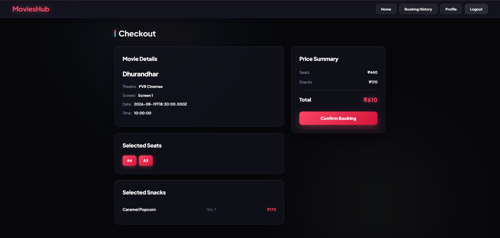

The Checkout page displays the complete booking summary, including movie, theatre, show details, selected seats, selected snacks, and the total amount before confirmation.

### 🎉 Booking Confirmation

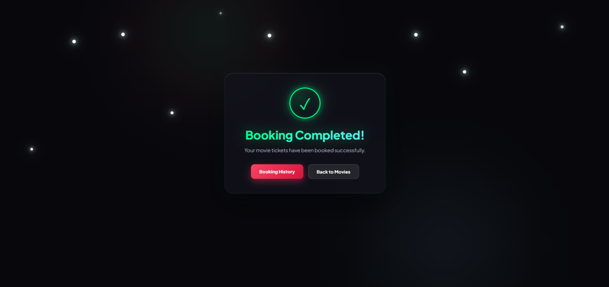

The Booking Confirmation page is displayed after the booking is successfully completed and provides options to view booking history or return to the movies.

### 📋 Booking History

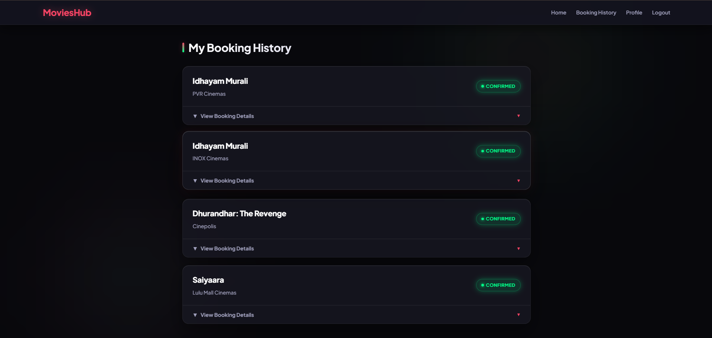

The Booking History page displays the user's previous bookings along with booking details, selected seats, selected snacks, and booking status.

### 🔐 Login

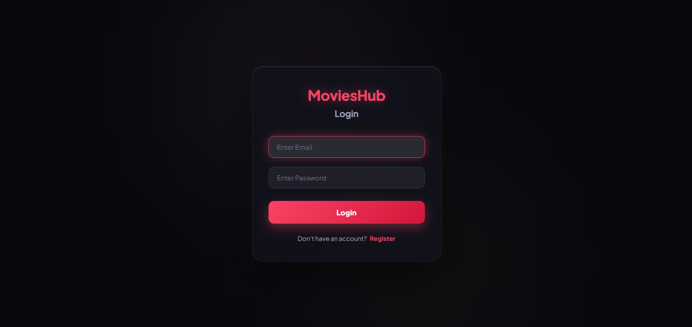

The Login page allows registered users to enter their email and password to access their account.

### 📝 Register

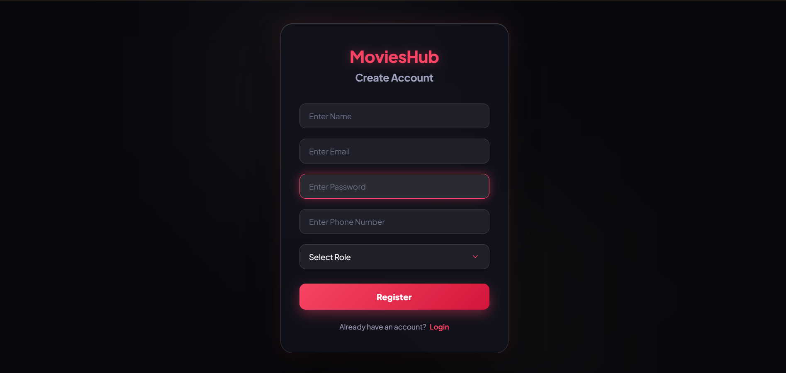

The Register page allows new users to create an account by providing their name, email, password, phone number, and role.

### 👤 Profile

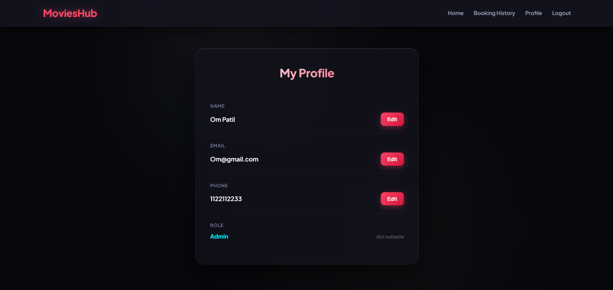

The Profile page displays the logged-in user's information and allows the user to update their name, email, and phone number.

### 🏡 Index Page

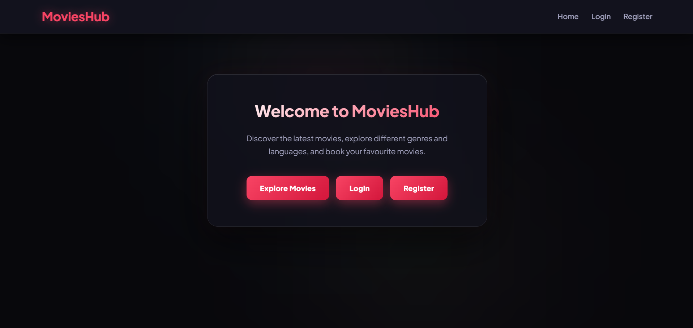

The Index Page is the entry page of MoviesHub. Users can explore movies, log in, or register. The navigation changes based on the user's login status.

## ⚙️ Configuration

The application uses `application.properties` to configure the Spring Boot application and MySQL database.

### Database Configuration

```properties
spring.application.name=MoviesHub

spring.datasource.driver-class-name=com.mysql.cj.jdbc.Driver

spring.datasource.url=jdbc:mysql://localhost:3306/moviehub

spring.datasource.username=root
spring.datasource.password=root
```
JPA Configuration
```
spring.jpa.show-sql=true
spring.jpa.properties.hibernate.format_sql=true
```

JSP Configuration
```
spring.mvc.view.prefix=/WEB-INF/Views/
spring.mvc.view.suffix=.jsp
```

